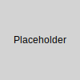

[](https://what-is-ada.robertdelanghe.com/dev-registry/)

# DevRegistry

## 1. Project Overview

`DevRegistry` is a local-first container registry and devcontainer build system designed to streamline development workflows. It provides a robust, `OCI`-compatible environment for building, storing, and managing container images directly on your local machine, while also offering seamless integration with `Git`, devcontainers, and advanced traceability features.

The primary problem `DevRegistry` solves is the complexity and overhead associated with managing container images during development. Traditional approaches often involve pushing and pulling images from remote registries, leading to slower iteration cycles and increased network dependency. `DevRegistry` brings the registry and build process local, accelerating development and providing deeper insights into your build artifacts. It's built with Cursor + `MCP` (Model Context Protocol) integrations in mind, enabling a more intelligent and context-aware development experience.

## 2. System Architecture

`DevRegistry` comprises several key components working in concert:

*   **Local `OCI` Registry:** A choice between `Harbor` (for a more feature-rich experience including a UI and security scanning) or a lightweight `registry:2` instance for minimal overhead. This serves as the local storage for all built container images.
*   **Build Engine:** Leverages `BuildKit` or `Docker Buildx` configured with a remote container driver. This allows for efficient, parallelized, and cache-optimized builds.
*   **`Git` Integration:** Automatically triggers new image builds upon commits to the `main` branch of your configured repositories.
*   **Tracing & Provenance:** Captures comprehensive build metadata, including `trace.json` files for build performance analysis, Software Bill of Materials (`SBOMs`), and `in-toto` attestations for supply chain security.
*   **DevContainer Support:** Facilitates the building of images specifically tailored for use within `.devcontainer.json` configurations, ensuring consistent development environments.
*   **Local Services Management:** Utilizes `Docker Compose` to define and run local services, including the registry itself and any dependent applications.
*   **User Interface:** Provides a lightweight registry viewer (e.g., `Harbor` UI) and a trace inspector (e.g., `Trivy` for `SBOMs`, `Perfetto` for `trace.json`) for easy access and analysis of build artifacts and metadata.
*   **Optional Remote Push:** Allows for selectively pushing validated and tested images to a remote `OCI`-compliant registry for broader team access or CI/CD integration.



## 3. Getting Started

To get `DevRegistry` up and running locally, you'll primarily use `Docker Compose`.

1.  **Prerequisites:**
    *   Docker installed and running.
    *   `Docker Compose` installed.
    *   `Git` installed.

2.  **Configuration (Illustrative - adapt to your `docker-compose.yml`):**
    Your `docker-compose.yml` will define services for the registry (`Harbor` or `registry:2`), potentially `BuildKit` (if not using `Docker Buildx` directly), and any monitoring/UI tools.

    ```yaml
    version: '3.8'
    services:
      local-registry:
        image: goharbor/harbor-core:v2.9.1 # Or registry:2
        ports:
          - "8080:8080" # Adjust port as needed
        volumes:
          - ./harbor_data:/data # Persistent storage for Harbor
        # ... other Harbor-specific configurations (database, redis, etc.)

      # buildkitd: # Optional: if running BuildKit as a separate service
      #   image: moby/buildkit:latest
      #   privileged: true
      #   volumes:
      #     - buildkit_data:/var/lib/buildkit
      #   ports:
      #     - "1234:1234" # Example port

    # volumes:
    #   harbor_data:
    #   buildkit_data:
    ```

3.  **Running `DevRegistry`:**

    ```bash
    # Navigate to the directory containing your docker-compose.yml
    docker-compose up -d
    ```
    This command starts all defined services in detached mode. You can then access the registry UI (if using `Harbor`) at `http://localhost:8080` (or your configured port).

4.  **Configuring `BuildKit`/`Buildx`:**
    Ensure your Docker client (or `BuildKit` client) is configured to use the local registry. For `Buildx`, you might create a new builder instance:

    ```bash
    docker buildx create --name local-builder --driver docker-container --use
    docker buildx inspect local-builder --bootstrap
    ```
    You'll also need to configure your build scripts or CI/CD pipelines to tag and push images to `localhost:<registry_port>/<your_image_name>`.

## 4. DevContainer Integration

`DevRegistry` simplifies building and using images for Visual Studio Code DevContainers.

1.  **Building DevContainer Images:**
    *   Define your `Dockerfile` as usual for your development environment.
    *   Build the image using `BuildKit`/`Buildx`, tagging it for the local registry:
        ```bash
        docker buildx build -t localhost:8080/my-project-devcontainer:latest --push .
        ```
        The `--push` flag sends the image directly to your local `DevRegistry`.

2.  **Consuming Images in `.devcontainer.json`:**
    In your project's `.devcontainer/devcontainer.json` file, reference the image from your local `DevRegistry`:

    ```json
    {
      "name": "My Project Dev Environment",
      "image": "localhost:8080/my-project-devcontainer:latest",
      // ... other devcontainer configurations (features, settings, etc.)
      "runArgs": ["--network=host"] // Potentially needed if devcontainer needs to access other local services
    }
    ```
    When `VS Code` (or `GitHub Codespaces`, if configured to use a local registry proxy) opens this devcontainer, it will pull the image from `DevRegistry`.

## 5. Git Integration

`DevRegistry` can be configured to automatically build and store images based on `Git` activity.

*   **Trigger Mechanism:** Builds are typically triggered by new commits to the `main` (or any designated) branch of your `Git` repositories. This is often achieved via webhooks or a polling mechanism integrated with your build controller.
*   **Build Process:**
    1.  A commit is pushed to `main`.
    2.  The build system (e.g., a Jenkins pipeline, GitHub Action, or a custom script) checks out the new commit.
    3.  `BuildKit`/`Buildx` is invoked to build the container image(s) defined in the repository.
    4.  Images are tagged appropriately (e.g., with the `Git` commit SHA, branch name, or a semantic version).
    5.  The built images are pushed to the local `DevRegistry`.
    6.  Traceability metadata (`SBOMs`, provenance) is generated and stored alongside the image or in a designated artifact repository.
*   **Trace Output:** The `Git` commit SHA, build logs, and links to trace files (like `trace.json` or `SBOMs`) can be associated with the image in the registry or a separate metadata store.

## 6. Traceability

`DevRegistry` emphasizes comprehensive build traceability:

*   **`trace.json`:** `BuildKit` can export detailed trace files in `trace.json` format. These files provide granular information about build steps, timings, cache utilization, and dependencies. They can be visualized using tools like `Perfetto` UI for performance analysis and debugging complex builds.
*   **`SBOMs` (Software Bill of Materials):** For each built image, an `SBOM` (e.g., in `SPDX` or `CycloneDX` format) is generated. This lists all software components, libraries, and their versions included in the image, which is crucial for vulnerability management and license compliance. Tools like `Trivy` can generate and inspect `SBOMs`.
*   **`in-toto` Provenance:** `in-toto` attestations are generated to create a verifiable record of how the software was built, packaged, and tested. This provides strong guarantees about the integrity and origin of the build artifacts, adhering to `SLSA` (Supply-chain Levels for Software Artifacts) principles.
*   **Storage:**
    *   Image layers are stored within the `OCI` registry.
    *   Metadata like `SBOMs` and `in-toto` attestations can be stored as `OCI` artifacts alongside the image in registries that support it (like `Harbor`), or in a separate artifact repository or even committed to `Git` (e.g., in an `attestations/` directory).
    *   `trace.json` files are typically stored as build artifacts, accessible via the build system or UI.

## 7. Extensibility

`DevRegistry` is designed to be adaptable:

*   **Adding New Build Targets:**
    *   Define a new `Dockerfile` for your application or service.
    *   Update your build scripts or CI/CD pipeline to include a build step for this new target, ensuring it tags and pushes the image to `DevRegistry`.
    *   If using `Docker Compose` for local services, add a new service definition to your `docker-compose.yml`.
*   **Supporting New Languages/Frameworks:**
    *   Primarily involves creating appropriate base images or `Dockerfile`s that include the necessary compilers, runtimes, and dependencies for the language/framework.
    *   `BuildKit`'s multi-stage builds and flexible syntax are well-suited for complex language-specific build processes.
*   **Adding New Trace Outputs:**
    *   **`BuildKit` Exporters:** `BuildKit` allows custom exporters. You could develop an exporter to generate metadata in a specific format or send it to a particular system.
    *   **Post-Build Hooks:** Implement scripts that run after a build completes to generate additional metadata (e.g., custom security scans, documentation generation) and store it appropriately.
    *   **Integrating New Tools:** Tools for scanning, linting, or analysis can be added as stages in your `Dockerfile`s or as steps in your build pipeline, with their output captured and stored.

## 8. Security Notes

Security is a key consideration for `DevRegistry`:

*   **Hardened Local Registry:**
    *   If using `Harbor`, leverage its built-in security features: user authentication, role-based access control (`RBAC`), vulnerability scanning (e.g., `Trivy` integration), and image signing (e.g., `Notary`).
    *   For `registry:2`, ensure it's run in a secure network environment. Consider adding an authentication proxy if needed.
    *   Regularly update your registry software to patch known vulnerabilities.
*   **`SBOMs` for Vulnerability Management:** The generated `SBOMs` are critical for identifying known vulnerabilities in your container images. Integrate `SBOM` analysis into your workflow to proactively address security risks.
*   **Robot Credentials / Service Accounts:** For automated processes (like CI/CD builds pushing to the registry), use dedicated robot accounts or service accounts with limited permissions. Avoid using personal user credentials for automation. Store these credentials securely (e.g., using Docker credential helpers, `HashiCorp Vault`, or CI/CD secrets management).
*   **Image Signing:** Implement image signing (e.g., using `Cosign` or `Notary`) to ensure the integrity and authenticity of images stored in `DevRegistry` and any remote registries they are pushed to.
*   **Network Policies:** If running in a Kubernetes-like environment locally (e.g., `minikube`, `k3d`), define network policies to restrict access to the registry service.

## 9. Use Cases

`DevRegistry` can be beneficial in various development scenarios:

*   **Rapid Local Iteration:** A developer working on a microservice can quickly build and test changes locally without waiting for CI or pushing to a remote registry. The image is immediately available in `DevRegistry` for local `Docker Compose` environments or devcontainers.
*   **Consistent Dev Environments with DevContainers:** A team can define a standard devcontainer image for their project, build it using `DevRegistry`, and ensure all team members use the exact same environment, pulling the image from the local registry. This reduces "works on my machine" issues.
*   **Pre-CI Validation:** Before pushing code, developers can run build processes that mirror CI, including generating `SBOMs` and provenance data. This allows for early detection of issues that might fail the main CI pipeline.
*   **Troubleshooting Build Issues:** `trace.json` and detailed build logs stored by `DevRegistry` can help developers diagnose and optimize slow or failing builds more effectively than relying solely on CI logs.
*   **Onboarding New Developers:** New team members can quickly get a fully configured development environment by simply running `docker-compose up` and opening the project in a devcontainer that pulls from `DevRegistry`.
*   **Air-Gapped or Limited Connectivity Development:** Teams working in environments with restricted internet access can rely on `DevRegistry` as a self-contained image source.
*   **Experimentation with Build Processes:** Safely experiment with new `BuildKit` features, `Dockerfile` optimizations, or provenance generation techniques in a local setting before rolling them out to shared CI systems.

## License

This project is licensed under the MIT License - see the `LICENSE.md` file for details.

## Contributing
